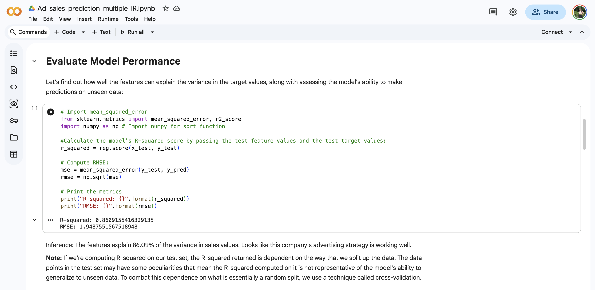
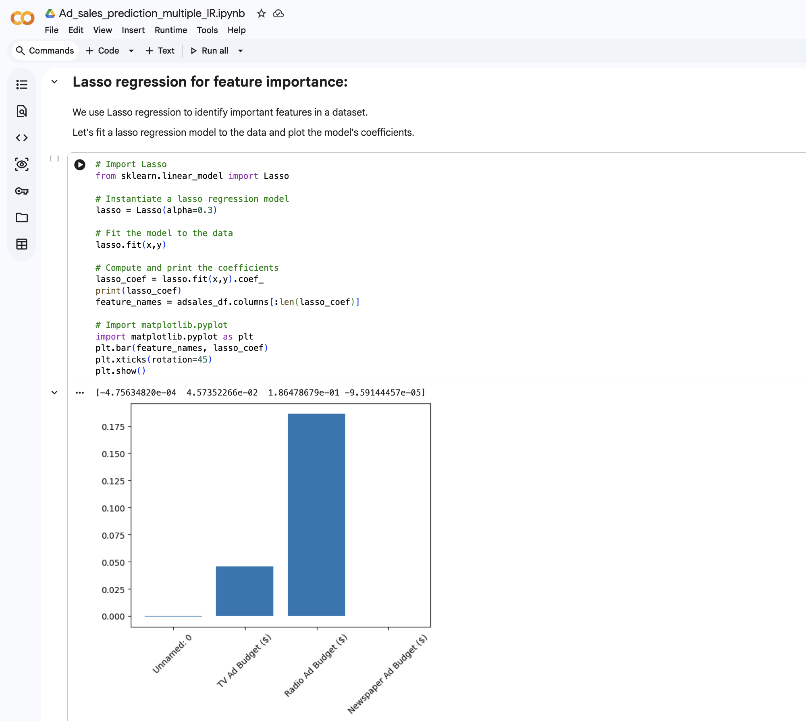

# Ad Sales Prediction using Multiple Linear Regression

## Overview
This machine learning project predicts sales revenue based on advertising spend across different marketing channels using Multiple Linear Regression.

## Problem Statement
The objective of this project is to analyze the relationship between advertising spend and sales revenue and build a predictive model that can estimate future sales accurately.

## Dataset Link
https://www.kaggle.com/datasets/saadsikander/advertising-budget-and-sales

## Technologies Used
- Python
- Pandas
- NumPy
- Matplotlib
- Seaborn
- Scikit-learn
- Jupyter Notebook

## Features
- Data preprocessing
- Exploratory Data Analysis (EDA)
- Multiple Linear Regression model
- Model training and testing
- Prediction and evaluation
- Data visualization

## Machine Learning Concepts
- Supervised Learning
- Multiple Linear Regression
- Feature analysis
- Model evaluation
- Prediction analysis

## Results
The model was trained successfully and evaluated using machine learning metrics such as:
- Mean Squared Error (MSE)
- R² Score

The project demonstrates how advertising investments influence overall sales performance.

## Output Screenshots

### Model Output

## How to Run
1. Clone the repository
2. Install dependencies from requirements.txt
3. Open notebook in Jupyter Notebook or Google Colab
4. Run all cells

## Future Improvements
- Add advanced regression models
- Improve feature engineering

## Author
Rutvi Patel
